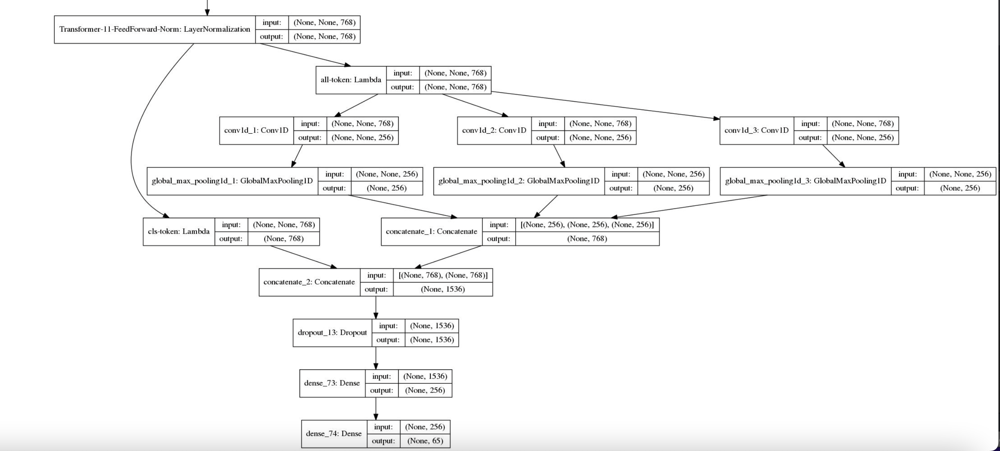

# 基于BERT的文本多标签多分类

## Dataset

某新闻数据集，第一个空格分割标签和文本，多标签再用`|`符号分割。形如：

```
人生-死亡|灾害/意外-坍/垮塌|人生-失联 青岛地铁施工段坍塌致3人遇难2名失联者仍在搜救
```

## Project

```
├── README.md
├── chinese_roformer-v2-char_L-12_H-768_A-12            12层bert base
│	 ├── bert_config.json
│	 ├── bert_model.ckpt.data-00000-of-00001
│	 ├── bert_model.ckpt.index
│	 ├── bert_model.ckpt.meta
│	 ├── checkpoint
│	 └── vocab.txt
├── chinese_roformer-v2-char_L-6_H-384_A-6              6层bert small
│	 ├── bert_config.json
│	 ├── bert_model.ckpt.data-00000-of-00001
│	 ├── bert_model.ckpt.index
│	 ├── bert_model.ckpt.meta
│	 ├── checkpoint
│	 └── vocab.txt
├── config.py                                           部分超参数配置文件
├── data                                                数据集
│	 ├── multi-classification-test.txt
│	 └── multi-classification-train.txt
├── evaluate.py                                         模型评估
├── loader.py                                           数据编码器
├── main.py
├── model.jpg                                           模型示意图
├── model.py                                            模型文件
├── nohup.out                                           训练日志
├── path.py                                             路径文件
├── predict.py                                          模型预测
├── train.py                                            模型训练
├── utils                                               bert4keras工具包，也可pip下载
│	 ├── __init__.py
│	 ├── adversarial.py
│	 ├── backend.py
│	 ├── layers.py
│	 ├── loss.py
│	 ├── models.py
│	 ├── optimizers.py
│	 ├── snippets.py
│	 └── tokenizers.py
└── weights
    ├── mlb.pkl                                         所有标签
    └── multi-label_roformer_v2_AdamEMA.h5              模型权重

5 directories, 36 files

```
## Requirements

```
Keras==2.2.4
matplotlib==3.4.0
pandas==1.2.3
pydot==1.4.1
tensorflow==1.14.0
tqdm==4.61.2
```

### 预训练模型

> RoFormer-Sim，又称SimBERTv2，是SimBERT模型的升级版。
> 
> [https://github.com/ZhuiyiTechnology/roformer-sim](https://github.com/ZhuiyiTechnology/roformer-sim)
> 
> 基于UniLM思想、融检索与生成于一体的BERT模型。
> 
> 权重下载：[https://github.com/ZhuiyiTechnology/pretrained-models](https://github.com/ZhuiyiTechnology/pretrained-models)


### 下游



多分类模型变多标签模型最后一层激活函数应由 softmax 变为 sigmoid

## 策略

- 使用EMA(exponential mobing average)滑动平均配合Adam作为优化策略。滑动平均可以用来估计变量的局部值，是的变量的更新与一段时间内的历史值有关。它的意义在于利用滑动平均的参数来提高模型在测试数据上的健壮性。
  EMA 对每一个待更新训练学习的变量 (variable) 都会维护一个影子变量 (shadow variable)。影子变量的初始值就是这个变量的初始值。
- BERT模型由于已经有了预训练权重，所以微调权重只需要很小的学习率，而LSTM和GlobalPointer层使用的`he_normal`初始化学习率，需要使用较大学习率，所以本模型使用[分层学习率](https://kexue.fm/archives/6418)
- 在Embedding层注入扰动，[对抗训练](https://kexue.fm/archives/7234) ，使模型更具鲁棒性。

## Train

```
187/187 [==============================] - 351s 2s/step - loss: 0.6388 - acc: 0.6758
1498it [00:29, 51.09it/s]
acc: 0.7790 best acc: 0.7790

Epoch 2/999
187/187 [==============================] - 363s 2s/step - loss: 0.0986 - acc: 0.8808
1498it [00:23, 63.30it/s]
acc: 0.8765 best acc: 0.8765

Epoch 3/999
187/187 [==============================] - 360s 2s/step - loss: 0.0729 - acc: 0.9018
1498it [00:27, 55.34it/s]
acc: 0.9005 best acc: 0.9005

... ...

Epoch 21/999
187/187 [==============================] - 359s 2s/step - loss: 0.0163 - acc: 0.9449
1498it [00:26, 57.33it/s]
Early stop count 3/5
acc: 0.9246 best acc: 0.9306

Epoch 22/999
187/187 [==============================] - 358s 2s/step - loss: 0.0172 - acc: 0.9441
1498it [00:26, 56.16it/s]
Early stop count 4/5
acc: 0.9259 best acc: 0.9306

Epoch 23/999
187/187 [==============================] - 352s 2s/step - loss: 0.0156 - acc: 0.9493
1498it [00:27, 54.31it/s]
Early stop count 5/5
acc: 0.9252 best acc: 0.9306
```

## Evaluate

运行`evaluate.py`文件

评估F1值，当且仅当单条样本的类别全部预测正确才算True，否则为False。读者可以后期自行修改判断标准，可以增设类别的权重然后算加权。

```
              precision    recall  f1-score   support

       交往-会见     0.9231    1.0000    0.9600        12
       交往-感谢     1.0000    1.0000    1.0000         8
       交往-探班     1.0000    0.9000    0.9474        10
       交往-点赞     0.9091    0.9091    0.9091        11
       交往-道歉     0.9048    1.0000    0.9500        19
     产品行为-上映     0.9706    0.9429    0.9565        35
     产品行为-下架     1.0000    1.0000    1.0000        24
     产品行为-发布     0.9933    0.9867    0.9900       150
     产品行为-召回     1.0000    1.0000    1.0000        36
     产品行为-获奖     0.9375    0.9375    0.9375        16
     人生-产子/女     0.9375    1.0000    0.9677        15
       人生-出轨     0.7500    0.7500    0.7500         4
       人生-分手     1.0000    1.0000    1.0000        15
       人生-失联     0.9286    0.9286    0.9286        14
       人生-婚礼     0.8333    0.8333    0.8333         6
       人生-庆生     1.0000    1.0000    1.0000        16
       人生-怀孕     1.0000    0.7500    0.8571         8
       人生-死亡     0.9495    0.8868    0.9171       106
       人生-求婚     1.0000    1.0000    1.0000         9
       人生-离婚     0.9706    1.0000    0.9851        33
       人生-结婚     0.9500    0.8837    0.9157        43
       人生-订婚     0.8182    1.0000    0.9000         9
     司法行为-举报     1.0000    1.0000    1.0000        12
     司法行为-入狱     0.9000    1.0000    0.9474        18
     司法行为-开庭     0.9333    1.0000    0.9655        14
     司法行为-拘捕     0.9775    0.9886    0.9831        88
     司法行为-立案     1.0000    1.0000    1.0000         9
     司法行为-约谈     0.9697    1.0000    0.9846        32
     司法行为-罚款     1.0000    1.0000    1.0000        29
     司法行为-起诉     0.9500    0.9048    0.9268        21
    灾害/意外-地震     1.0000    1.0000    1.0000        14
  灾害/意外-坍/垮塌     1.0000    1.0000    1.0000        10
    灾害/意外-坠机     1.0000    1.0000    1.0000        13
    灾害/意外-洪灾     1.0000    0.8571    0.9231         7
    灾害/意外-爆炸     1.0000    0.8889    0.9412         9
    灾害/意外-袭击     1.0000    0.8750    0.9333        16
    灾害/意外-起火     0.9630    0.9630    0.9630        27
    灾害/意外-车祸     0.9444    0.9714    0.9577        35
     竞赛行为-夺冠     0.8833    0.9464    0.9138        56
     竞赛行为-晋级     0.8919    1.0000    0.9429        33
     竞赛行为-禁赛     0.9375    0.9375    0.9375        16
     竞赛行为-胜负     0.9769    0.9906    0.9837       213
     竞赛行为-退役     0.8462    1.0000    0.9167        11
     竞赛行为-退赛     0.8571    1.0000    0.9231        18
     组织关系-停职     0.9167    1.0000    0.9565        11
     组织关系-加盟     1.0000    0.9268    0.9620        41
     组织关系-裁员     1.0000    0.8947    0.9444        19
     组织关系-解散     0.9091    1.0000    0.9524        10
     组织关系-解约     0.8333    1.0000    0.9091         5
     组织关系-解雇     0.8462    0.8462    0.8462        13
   组织关系-辞/离职     1.0000    0.9859    0.9929        71
     组织关系-退出     0.9048    0.8636    0.8837        22
     组织行为-开幕     0.9375    0.9375    0.9375        32
     组织行为-游行     1.0000    1.0000    1.0000         9
     组织行为-罢工     1.0000    1.0000    1.0000         8
     组织行为-闭幕     1.0000    1.0000    1.0000         9
    财经/交易-上市     0.8750    1.0000    0.9333         7
 财经/交易-出售/收购     1.0000    1.0000    1.0000        24
    财经/交易-加息     1.0000    1.0000    1.0000         3
    财经/交易-涨价     0.8000    0.8000    0.8000         5
    财经/交易-涨停     0.9643    1.0000    0.9818        27
    财经/交易-融资     1.0000    1.0000    1.0000        14
    财经/交易-跌停     1.0000    1.0000    1.0000        14
    财经/交易-降价     0.9000    1.0000    0.9474         9
    财经/交易-降息     1.0000    1.0000    1.0000         4

   micro avg     0.9604    0.9650    0.9627      1657
   macro avg     0.9491    0.9583    0.9522      1657
weighted avg     0.9618    0.9650    0.9626      1657
 samples avg     0.9720    0.9760    0.9693      1657
```

## Predict

运行`predict.py`文件

设置阈值，当sigmoid结果大于阈值时，判定为1，否则为0

```python
one_hot, label = predict("xxxx")
```
```
测试样本预测标签： 灾害/意外-爆炸
```